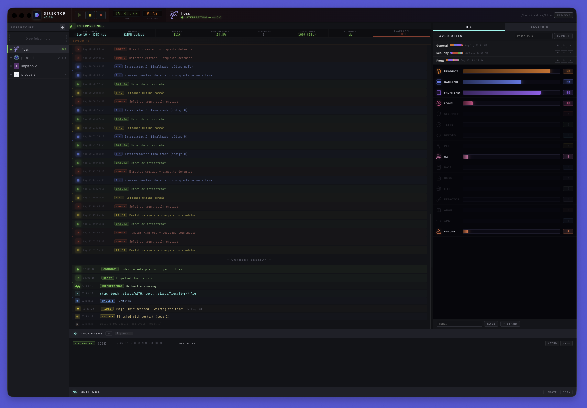

# Director: Autonomous AI Orchestration Environment



**DISCLAIMER: THIS SOFTWARE IS PROVIDED "AS IS", WITHOUT WARRANTY OF ANY KIND, EXPRESS OR IMPLIED, INCLUDING BUT NOT LIMITED TO THE WARRANTIES OF MERCHANTABILITY, FITNESS FOR A PARTICULAR PURPOSE, AND NONINFRINGEMENT. IN NO EVENT SHALL THE AUTHORS OR COPYRIGHT HOLDERS BE LIABLE FOR ANY CLAIM, DAMAGES, OR OTHER LIABILITY, WHETHER IN AN ACTION OF CONTRACT, TORT, OR OTHERWISE, ARISING FROM, OUT OF, OR IN CONNECTION WITH THE SOFTWARE OR THE USE OR OTHER DEALINGS IN THE SOFTWARE. USE AT YOUR OWN RISK. THE AUTONOMOUS AGENT HAS DIRECT WRITE ACCESS TO YOUR LOCAL FILESYSTEM.**

**Director** is an Electron desktop app that orchestrates autonomous AI agents across software projects. It runs infinite development cycles where AI agents read your codebase, plan work from a roadmap, write code, run tests, commit, and repeat — continuously and without human intervention.

You define the priorities. The AI executes. As long as the orchestra plays, the software evolves.

## Supported AI Agents

| Agent | Provider | Models |
|-------|----------|--------|
| **Claude** | Anthropic | Fable 5, Opus 5, Sonnet 5, Opus 4.6, Sonnet 4.6, Haiku 4.5 |
| **Antigravity** | AGY | Gemini 3.1 Pro, Gemini 3.7 Flash, Claude 4.6 via AGY |
| **Codex** | OpenAI | Codex |
| **Aider** | Multi-provider | Claude Sonnet 4.6, GPT-4o, Gemini 2.5 Pro, DeepSeek Coder |

## Key Features

### Workspace Management
Load repositories by clicking or dragging folders into the interface. Director automatically installs the orchestra protocol into any project that lacks it — no manual setup required.

### Focus Mixer (Atriles)
16 dynamic faders (0–100) define the AI's operational priorities. The agent re-evaluates weights at the start of every cycle:

Product & Features, Backend, Frontend & UI, Business Logic, Security, Quality & Tests, DevOps, Performance, UX & Accessibility, Data & Databases, Documentation, i18n, Refactoring, Architecture, API Integrations, Error Handling.

Save custom mixes as presets, export/import mix libraries, and load from 5 built-in presets (Elite Balanced, Quality First, Ship Fast, Hardening, UX Polish).

### Smart Mix
A self-regulating algorithm that continuously adjusts the focus mixer based on actual commit patterns. Every 3 iterations it analyzes the last 50 git commits, detects over/under-represented categories, and nudges weights to keep development balanced. Categories that exceed 2x their budget are automatically frozen.

### Anti-Slop Enforcement
Harness-level detection and correction for autonomous agent misbehavior:
- **Category repetition ban** — same category 3+ consecutive cycles triggers violation
- **Module concentration ban** — 3+ commits to the same file/module per session blocked
- **Commit mislabeling detection** — `feat()` for non-features (i18n, UUID checks) is flagged
- **Mechanical busywork detection** — unbatched repetitive commits are logged
- **Category budget cap** — categories exceeding 2x budget are frozen
- **Test health gate** — failing tests block all other work until fixed
- **Improvement mode cap** — max 10 consecutive improvement cycles before requiring human input
- **Product starvation alert** — auto-injects product directive after sustained zero-product work

### Anti-Hallucination System
External verification of every claimed commit. The harness compares git HEAD before and after each session. Fake commit hashes, fabricated test results, or zero-commit sessions trigger a 5-strike breaker with exponential backoff.

### Lifecycle History
Persistent event timeline that survives app restarts, log clears, and git operations. Tracks commits, features, cycle closes, hot reloads, and auto-resumes with color-coded icons.

### Hot Reload
When Director's own files change, protocol updates are synced to running projects without killing the AI mid-work. The agent picks up changes at the next iteration start.

### Session Analysis
Stop an orchestra to generate a summary of commit history, roadmap progress, pending tasks, and execution logs — formatted for planning the next session.

## Getting Started

### Requirements
- **Node.js** 18+
- **macOS / Linux** (bash environment required)
- At least one AI CLI in PATH: `claude`, `agy`, `codex`, or `aider`

### Installation

```bash
cd ~/Development
git clone https://github.com/reatcas/director.git
cd director
npm install
```

### Run from Source
```bash
npm start
```

### Compile to Desktop App
```bash
# macOS
npm run build:mac

# Linux
npm run build:linux
```

Compiled output goes to `dist/`.

## Orchestra Protocol

Director embeds a complete development protocol that gets installed into each project:

- **CLAUDE.md** — Constitution with 29 rules covering product gates, anti-slop enforcement, token economy, and autonomy
- **loop.md** — Per-session instruction set with boot sequence, execution flow, and compliance reporting
- **run.sh** — Harness script managing the infinite loop, Smart Mix algorithm, anti-hallucination checks, and usage limit handling
- **Skills** — Modular capabilities: verification-gate, browser-vision, db-vision, roadmap-sync, backlog-generator, cycle-audit, ip-protection

## License

**Director** and its embedded **Orchestra** framework are licensed under the **AGPL-3.0 License**.

Software is meant to be free, and the music should be shared with the world. See the [LICENSE](LICENSE) file for details.

---

*"Where words fail, music speaks. Where human typing ends, the perpetual orchestra begins."*
