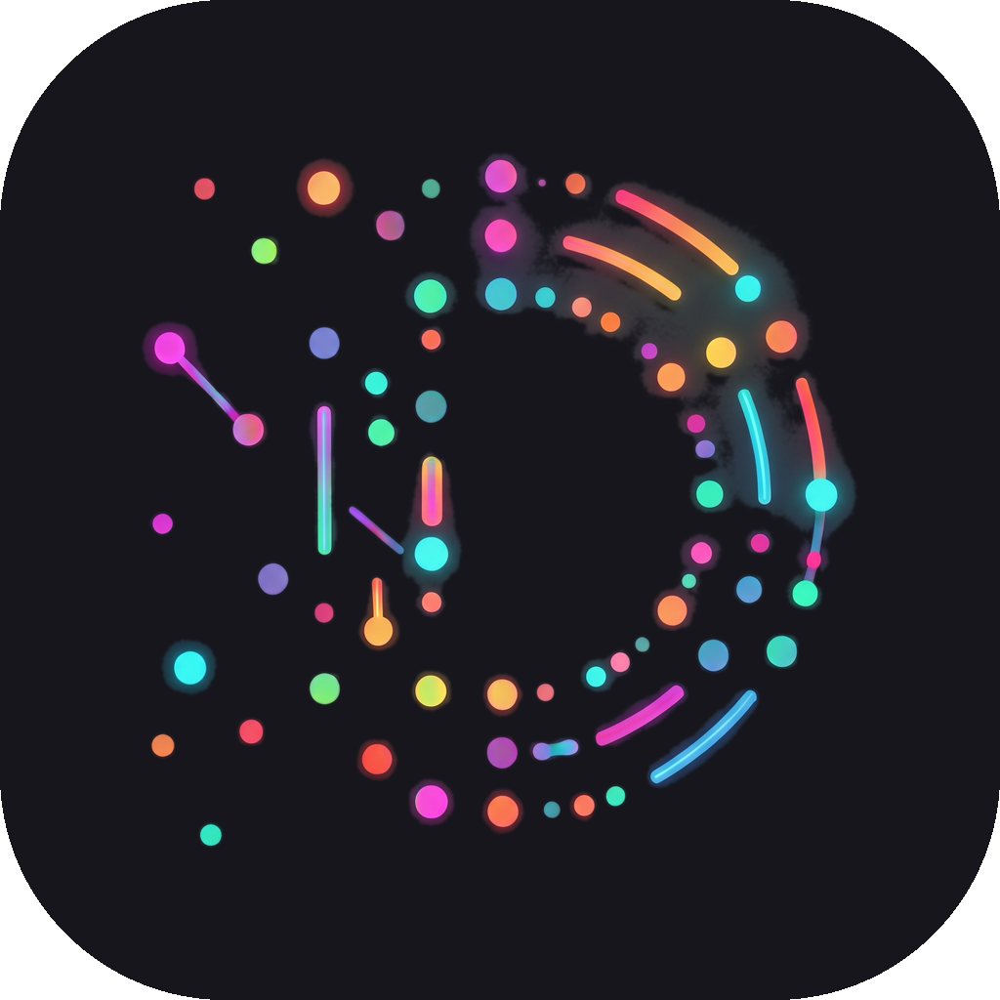

<p align="center">
  
</p>

<h1 align="center">Director</h1>

<p align="center">
  <strong>Autonomous AI development orchestrator.</strong><br>
  Run infinite coding cycles on any project — while you sleep, ship, or focus elsewhere.
</p>

<p align="center">
  <a href="#install">Install</a> · <a href="#how-it-works">How it works</a> · <a href="#features">Features</a> · <a href="#configuration">Configuration</a> · <a href="#architecture">Architecture</a> · <a href="LICENSE">License</a>
</p>

---

## The problem

AI coding assistants are powerful but **manual** — you prompt, wait, review, prompt again. At $20/hour of API time, an 8-hour coding session burns through your quota while you sit watching. Overnight hours go to waste. Other projects pile up.

## The solution

**Director turns AI into a tireless autonomous developer.** Point it at a repo, define what to focus on, hit Play. The AI reads the codebase, plans work from a roadmap, writes code, runs tests, commits — and loops forever. No human in the loop.

### Who is it for?

| Role | Benefit |
|------|---------|
| **Solo developer** | Ship features while you sleep. Wake up to 15 commits and a green test suite. |
| **Product manager** | Define priorities in the mixer, connect your Notion board, watch the roadmap execute itself. |
| **Team lead** | Orchestrate 5 projects in parallel. Each gets its own focus weights and AI budget. |
| **Agency / freelancer** | Run multiple client projects overnight. Bill for results, not for babysitting a terminal. |

---

## Install

```bash
git clone https://github.com/reatcas/director.git
cd director
npm install
npm start
```

Requires: Node.js 18+, macOS/Linux.

---

## How it works

```
You                          Director                        Your repo
 │                              │                               │
 ├─ Add project ───────────────►│                               │
 ├─ Set focus mixer ───────────►│                               │
 ├─ Hit ▶ Play ────────────────►│──── read codebase ───────────►│
 │                              │◄─── plan from ROADMAP ────────│
 │                              │──── write code ──────────────►│
 │                              │──── run tests ───────────────►│
 │   (sleep / work on           │──── commit ──────────────────►│
 │    other things)             │──── loop ─────────────────────┤
 │                              │         ...forever...         │
 ├─ Hit ◼ Stop ────────────────►│                               │
 └─ Review commits ─────────────┘                               │
```

---

## Features

### Focus Mixer

16-category equalizer that controls **what the AI works on**. Drag sliders in real time — the orchestra adjusts on the next cycle.

| Category | What it does |
|----------|-------------|
| Product | New features from ROADMAP.md |
| Backend / Frontend | Server and client code |
| Security | Input validation, auth, hardening |
| Tests | Test coverage, regression |
| Performance | Profiling, optimization |
| UX | Accessibility, responsiveness |
| + 10 more | Docs, i18n, refactoring, APIs, DevOps, architecture, errors, data, logic |

**Saved mixes** — Save, load, duplicate, and share mixer configurations. The active mix shows at the top with a Smart Mix brain toggle.

**Smart Mix v3** — Self-regulating algorithm that analyzes the last 50 commits and adjusts weights automatically. Prevents category starvation and oscillation with exponential damping.

**Custom stands** — Add your own categories with icons, colors, and descriptions. Right-click to edit or delete.

### Multi-Project Orchestration

Run multiple projects simultaneously. Each gets its own:
- Focus mixer weights
- AI model selection
- Resource budget (CPU, memory, tokens)
- Lifecycle timeline and compliance tracking

Director manages contention, priority inheritance, and resource locking across all running orchestras.

### Smart Model Routing

Automatically selects the right model for each task:
- **Sonnet** for regular cycles (fast, cheap)
- **Opus** for deep-work items and architectural reviews
- **Haiku** for mechanical tasks (i18n, formatting)

Result: 70–80% token savings compared to using Opus for everything.

### Deep Work Mode

Complex features that span multiple files and layers get the Architect-Executor treatment:
1. **Investigate** — full codebase analysis
2. **Plan** — dependency DAG with ordered tasks
3. **Execute** — one commit per task, verification between each
4. **Ship** — the entire module lands in one session

### Blueprint + Note Integrations

Connect your project knowledge to supercharge the orchestrator:

| Source | How it works |
|--------|-------------|
| **Notion** | Connect your workspace API, select a database, sync pages into blueprint modules |
| **Obsidian** | Point to a vault folder, filter by tags (#feature, #bug), parse frontmatter + wikilinks |
| **Markdown folder** | Any folder of .md files — titles and content become project modules |

The SYNC button pulls all sources, merges them into the Blueprint, and generates a ROADMAP. A feedback panel shows what's missing before the orchestra can start.

### Safeguards

- **Verification gate** — tests must pass before every commit
- **Anti-hallucination** — detects fake commit hashes, tracks zero-commit streaks (5-strike breaker)
- **Anti-slop** — catches mislabeled `feat()` commits, mechanical busywork, and module concentration
- **Category ban** — same category 3+ consecutive cycles = violation
- **Budget cap** — category exceeding 2x its budget gets frozen

### Token Economy

| Feature | Savings |
|---------|---------|
| Smart model routing | 70–80% vs all-Opus |
| Caveman mode (200-token cap) | 60% fewer output tokens |
| Context compaction at 35% | Prevents window overflow |
| Quiet flags (dot reporter) | Minimal test output in context |

### Desktop App

- Drag-and-drop project management
- Transport controls: Play / Stop / Kill
- Live log viewer with structured entries
- Commit timeline and compliance sparklines
- Token burn rate and usage tracking
- Desktop notifications for stalls, alerts, usage limits
- Keyboard shortcuts + command palette
- Neural particle system background
- Dark and light themes

---

## Configuration

```json
{
  "model": "claude-sonnet-4-6",
  "modelComplex": "claude-opus-4-6",
  "caveman": true,
  "compactAt": 35,
  "smartMix": true,
  "smartModel": true,
  "focus": {
    "product": 30,
    "backend": 20,
    "frontend": 15,
    "quality_tests": 20,
    "security": 10,
    "performance": 5
  }
}
```

| Field | Default | Description |
|-------|---------|-------------|
| `model` | `claude-sonnet-4-6` | Base model for regular cycles |
| `modelComplex` | same as model | Model for deep-work and architect reviews |
| `modelFast` | `claude-haiku-4-5` | Model for mechanical tasks |
| `caveman` | `true` | 200-token response cap |
| `compactAt` | `35` | Context compaction threshold (%) |
| `smartMix` | `true` | Self-regulating weight adjustment |
| `smartModel` | `true` | Auto-select model by task complexity |

---

## Architecture

```
Director (Electron main)
├── renderer.js              UI: mixer, logs, metrics, integrations
├── main.js                  IPC, process management, lifecycle
├── resource-scheduler.js    Weighted allocator (sigmoid retention curves)
├── context-protocol.js      Delta context management, token estimation
├── coordination-protocol.js Multi-orchestra sync, priority inheritance
├── preload.js               Secure IPC bridge (50+ methods)
└── resources/orchestra/
    ├── run.sh               Infinite loop harness (Smart Mix v3)
    └── CLAUDE.md            AI constitution (46 rules)
```

**12,700 lines of code · 5,100+ tests · 0 dependencies beyond Electron**

---

## Usage

1. **Add a project** — click + or drag a folder into the sidebar
2. **Set the mixer** — adjust category sliders, or load a saved preset
3. **Connect sources** — (optional) link Notion, Obsidian, or markdown notes in the Blueprint tab
4. **Hit ▶ Play** — the AI starts an infinite development cycle
5. **Go do something else** — check back for commits, metrics, and compliance reports

---

## License

[AGPL-3.0](LICENSE) — free to use, modify, and distribute. Derivative works must remain open source.

Built by [René Antonio Casaña](https://x.com/reatcas).
